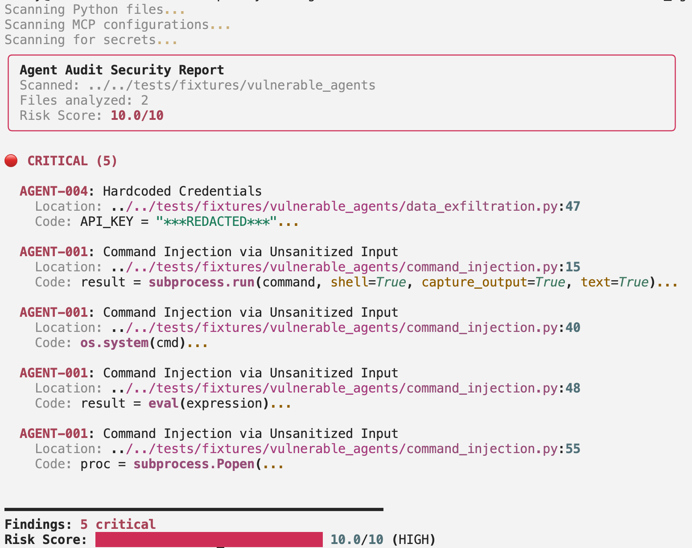

# Agent Audit

[](https://pypi.org/project/agent-audit/)
[](https://pypi.org/project/agent-audit/)
[](https://opensource.org/licenses/MIT)
[](https://github.com/HeadyZhang/agent-audit/actions/workflows/ci.yml)

> 🛡️ Security scanner for AI agents and MCP configurations. Detects vulnerabilities based on the **OWASP Agentic Top 10**.
>
> 🛡️ 基于 **OWASP Agentic Top 10** 的 AI Agent 和 MCP 配置安全扫描器

<p align="center">
  
</p>

## ✨ Features | 功能特性

- **🔍 Python AST Scanning** - Detects dangerous patterns like `shell=True`, `eval()`, and tainted input flows
- **⚙️ MCP Configuration Scanning** - Validates MCP server configurations for security issues
- **🔐 Secret Detection** - Finds hardcoded credentials (AWS keys, API tokens, private keys)
- **🌐 Runtime MCP Inspection** - Probes MCP servers without executing tools ("Agent Nmap")
- **📊 Multiple Output Formats** - Terminal, JSON, SARIF (for GitHub Code Scanning), Markdown

---

- **🔍 Python AST 扫描** - 检测危险模式，如 `shell=True`、`eval()`、受污染的输入流
- **⚙️ MCP 配置扫描** - 验证 MCP 服务器配置的安全问题
- **🔐 密钥检测** - 发现硬编码凭证（AWS 密钥、API Token、私钥）
- **🌐 MCP 运行时检查** - 在不执行工具的情况下探测 MCP 服务器
- **📊 多种输出格式** - 终端、JSON、SARIF、Markdown

## 🚀 Quick Start | 快速开始

### Installation | 安装

```bash
pip install agent-audit
```

### Basic Usage | 基本使用

```bash
# Scan current directory | 扫描当前目录
agent-audit scan .

# Scan with JSON output | JSON 格式输出
agent-audit scan ./my-agent --format json

# Scan with SARIF output for GitHub Code Scanning
# SARIF 格式输出（用于 GitHub 代码扫描）
agent-audit scan . --format sarif --output results.sarif

# Fail CI on critical findings only | 仅在严重问题时失败
agent-audit scan . --fail-on critical

# Inspect an MCP server at runtime | 运行时检查 MCP 服务器
agent-audit inspect stdio -- npx -y @modelcontextprotocol/server-filesystem /tmp
```

## 📖 Understanding Results | 理解扫描结果

When you run `agent-audit scan`, findings are reported with:

| Field | Description |
|-------|-------------|
| **Rule ID** | Unique identifier (e.g., AGENT-034). See [Rule Reference](docs/RULES.md) |
| **Severity** | CRITICAL > HIGH > MEDIUM > LOW > INFO |
| **Location** | File path and line number |
| **Message** | What was detected and why it matters |

### What to Do | 如何处理

| Severity | Action |
|----------|--------|
| **CRITICAL/HIGH** | Fix before merging. These represent exploitable vulnerabilities. |
| **MEDIUM** | Fix when possible. These are defense-in-depth issues. |
| **LOW/INFO** | Review and decide. May be intentional or low-risk. |

To suppress a known issue, add `# noaudit` comment or configure `.agent-audit.yaml`.

扫描发现问题后，CRITICAL/HIGH 需要在合并前修复，MEDIUM 尽量修复，LOW/INFO 根据情况决定。

---

## 🔗 GitHub Action

Add Agent Audit to your CI/CD pipeline | 添加到你的 CI/CD 流程：

```yaml
name: Security Scan
on: [push, pull_request]

jobs:
  agent-audit:
    runs-on: ubuntu-latest
    steps:
      - uses: actions/checkout@v4
      
      - name: Run Agent Audit
        uses: HeadyZhang/agent-audit@v1
        with:
          path: '.'
          fail-on: 'high'
          upload-sarif: 'true'
```

### Action Inputs | Action 参数

| Input | Description | Default |
|-------|-------------|---------|
| `path` | Path to scan | `.` |
| `format` | Output format: `terminal`, `json`, `sarif`, `markdown` | `sarif` |
| `severity` | Minimum severity: `info`, `low`, `medium`, `high`, `critical` | `low` |
| `fail-on` | Exit with error if findings at this severity | `high` |
| `baseline` | Path to baseline file for incremental scanning | - |
| `upload-sarif` | Upload SARIF to GitHub Security tab | `true` |

For more CI/CD platforms, see [CI/CD Integration Guide](docs/CI-INTEGRATION.md).

其他 CI/CD 平台请参阅 [CI/CD 集成指南](docs/CI-INTEGRATION.md)。

## 🎯 OWASP Agentic Top 10 Coverage | OWASP Agentic Top 10 覆盖

Agent Audit now covers the full **OWASP Agentic Top 10 for 2026** (ASI-01 ~ ASI-10).

Agent Audit 现已完整覆盖 **OWASP Agentic Top 10 for 2026** (ASI-01 ~ ASI-10)。

| OWASP ID | Risk Name | Rules | Status |
|----------|-----------|-------|--------|
| ASI-01 | Agent Goal Hijack | AGENT-010, AGENT-011 | ✅ |
| ASI-02 | Tool Misuse & Exploitation | AGENT-001, AGENT-012 | ✅ |
| ASI-03 | Identity & Privilege Abuse | AGENT-002, AGENT-013, AGENT-014 | ✅ |
| ASI-04 | Supply Chain Vulnerabilities | AGENT-005, AGENT-015, AGENT-016 | ✅ |
| ASI-05 | Unexpected Code Execution | AGENT-017 | ✅ |
| ASI-06 | Memory & Context Poisoning | AGENT-018, AGENT-019 | ✅ |
| ASI-07 | Insecure Inter-Agent Comm | AGENT-020 | ✅ |
| ASI-08 | Cascading Failures | AGENT-021, AGENT-022 | ✅ |
| ASI-09 | Human-Agent Trust Exploitation | AGENT-023 | ✅ |
| ASI-10 | Rogue Agents | AGENT-024, AGENT-025 | ✅ |

## 📋 Rules | 规则

Agent Audit includes **40 built-in rules** covering all 10 OWASP Agentic categories:

Agent Audit 包含 **40 条内置规则**，覆盖所有 10 个 OWASP Agentic 类别：

| Category | Rules | Example Issues |
|----------|-------|----------------|
| ASI-01: Goal Hijacking | 4 | Prompt injection, missing goal validation |
| ASI-02: Tool Misuse | 9 | Command injection, SQL injection, unsanitized input |
| ASI-03: Privilege Abuse | 4 | Excessive permissions, long-lived credentials |
| ASI-04: Supply Chain | 5 | Unverified MCP servers, unpinned dependencies |
| ASI-05: Code Execution | 3 | Unsandboxed exec, data exfiltration chain |
| ASI-06: Memory Poisoning | 2 | Unsanitized memory input, unbounded history |
| ASI-07: Inter-Agent Comms | 1 | Unencrypted channels |
| ASI-08: Cascading Failures | 3 | Missing circuit breaker, no error handling |
| ASI-09: Trust Exploitation | 6 | Missing human approval, impersonation risk |
| ASI-10: Rogue Agents | 3 | No kill switch, self-modification risk |

See **[Rule Reference](docs/RULES.md)** for complete details, fix guidance, and code examples.

完整规则详情、修复指南和代码示例请查看 **[规则参考](docs/RULES.md)**。

## ⚙️ Configuration | 配置

Create `.agent-audit.yaml` to customize scanning | 创建 `.agent-audit.yaml` 自定义扫描：

```yaml
# Allowed network hosts | 允许的网络主机
allowed_hosts:
  - "*.internal.company.com"
  - "api.openai.com"

# Ignore rules | 忽略规则
ignore:
  - rule_id: AGENT-003
    paths:
      - "auth/**"
    reason: "Auth module legitimately communicates externally"

# Scan settings | 扫描设置
scan:
  exclude:
    - "tests/**"
    - "venv/**"
  min_severity: low
  fail_on: high
```

## 📈 Baseline Scanning | 基线扫描

Track new findings incrementally | 增量跟踪新发现：

```bash
# Save current findings as baseline | 保存当前发现为基线
agent-audit scan . --save-baseline baseline.json

# Only report new findings | 仅报告新发现
agent-audit scan . --baseline baseline.json
```

## 📖 CLI Reference | 命令行参考

```
Usage: agent-audit [OPTIONS] COMMAND [ARGS]...

Commands:
  scan     Scan agent code and configurations
  inspect  Inspect an MCP server at runtime
  init     Initialize configuration file

Options:
  --version   Show version
  -v          Enable verbose output
  -q          Only show errors
  --help      Show this message
```

## 📚 Documentation | 文档

| Document | Description |
|----------|-------------|
| **[Rule Reference](docs/RULES.md)** | All 40 rules with fix guidance and code examples |
| **[CI/CD Integration](docs/CI-INTEGRATION.md)** | GitHub Actions, GitLab, Jenkins, Azure DevOps |
| **[API Stability](docs/STABILITY.md)** | What interfaces you can depend on |
| **[Contributing](CONTRIBUTING.md)** | Development setup and guidelines |

## 🛠️ Development | 开发

See [CONTRIBUTING.md](CONTRIBUTING.md) for development setup and guidelines.

查看 [CONTRIBUTING.md](CONTRIBUTING.md) 了解开发设置和指南。

```bash
# Clone the repository | 克隆仓库
git clone https://github.com/HeadyZhang/agent-audit
cd agent-audit

# Install dependencies | 安装依赖
cd packages/audit
poetry install

# Run tests (tests are at project root) | 运行测试（测试在项目根目录）
poetry run pytest ../../tests/ -v

# Run the scanner | 运行扫描器
poetry run agent-audit scan .
```

## 📄 License | 许可证

MIT License - see [LICENSE](LICENSE) for details.

## 🙏 Acknowledgments | 致谢

- Based on the [OWASP Agentic Security Top 10](https://owasp.org/www-project-agentic-security/)
- Inspired by the need for better AI agent security tooling

---

<p align="center">
  Made with ❤️ for the AI agent security community
</p>
